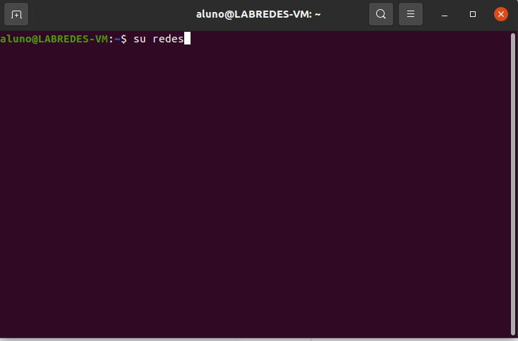
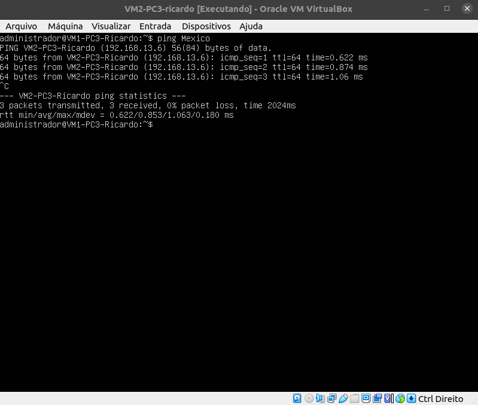
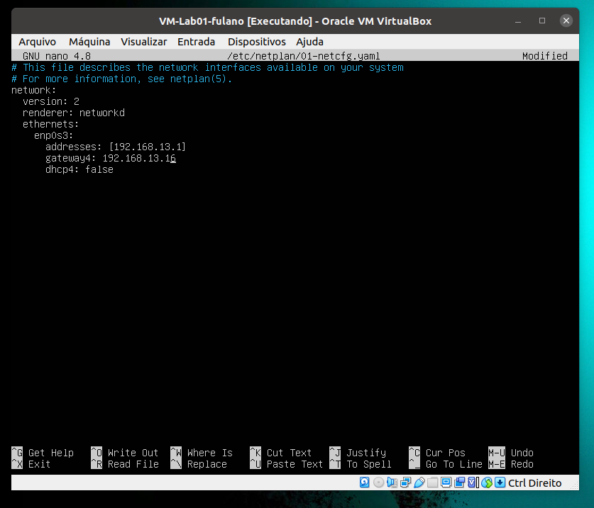
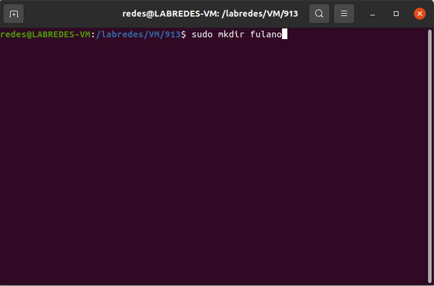
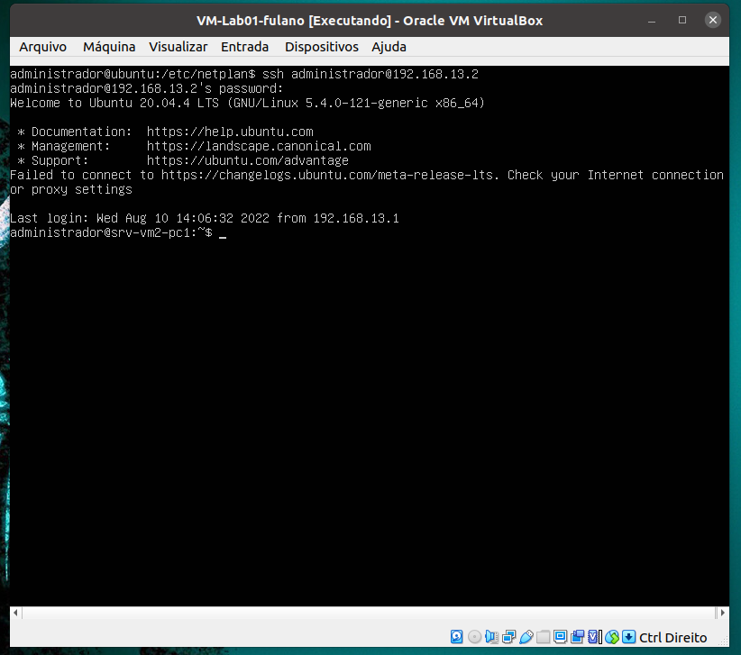
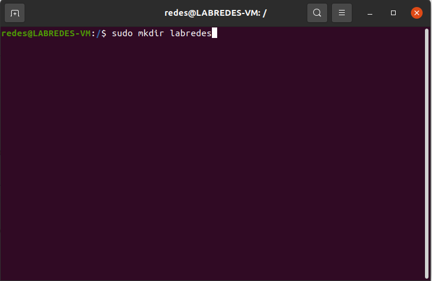
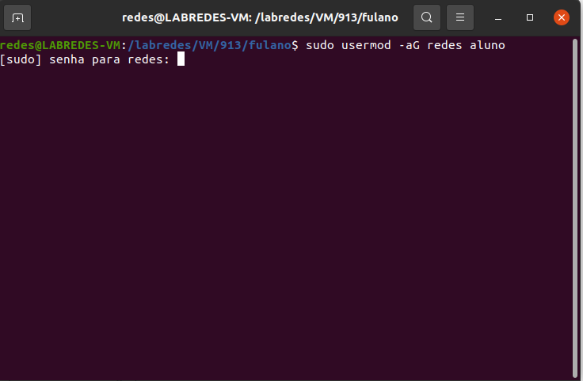
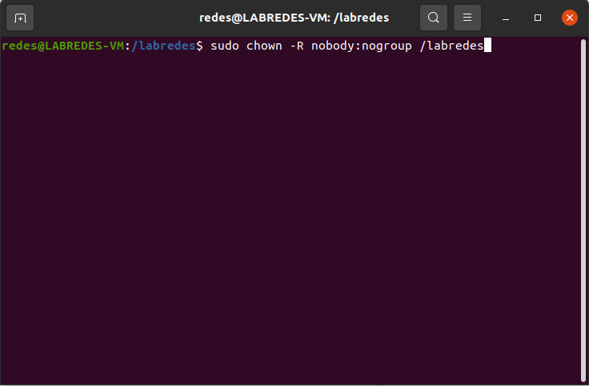

## **Projeto De Redes Do Segundo Bimestre**

### **1) Definindo as Configurações de Redes**

```
Tabela 1: Definições de endereços IPs da Rede e Nomes de Hosts
------------------------------------------------------------------------
|  DESCRICAO  |       IP         |             HOSTNAME                |
-----------------------------------------------------------------------|
| rede        | 192.168.13.0     |                                     |
| máscara     | 255.255.255.240  |                                     |
| Gateway     | 192.168.13.16    |                                     |
| VM1-PC1     | 192.168.13.1     |   vm1pc1-913-grupo1.ifalara.net     |
| VM2-PC1     | 192.168.13.2     |   vm2pc1-913-grupo1.ifalara.net     |
| VM1-PC2     | 192.168.13.3     |   vm1pc2-913-grupo1.ifalara.net     |
| VM2-PC2     | 192.168.13.4     |   vm2pc2-913-grupo1.ifalara.net     |
| VM1-PC3     | 192.168.13.5     |   vm1pc3-913-grupo1.ifalara.net     |
| VM2-PC3     | 192.168.13.6     |   vm2pc3-913-grupo1.ifalara.net     |
| VM1-PC4     | 192.168.13.7     |   vm1pc4-913-grupo1.ifalara.net     |
| VM2-PC4     | 192.168.13.8     |   vm2pc4-913-grupo1.ifalara.net     |
------------------------------------------------------------------------
```

```
Tabela 1: Configurações de IPs da Rede e Nomes de Hosts
--------------------------------------------------------------------------------
| DESCRIÇÃO |      IP      |  Nome do Host  |          FQDN          | Apelido |
--------------------------------------------------------------------------------
| VM1-PC1   | 192.168.13.1 | srv-vm1-pc1    | vm1pc1-913.ifalara.net | França  |
| VM2-PC1   | 192.168.13.2 | srv-vm2-pc1    | vm2pc1-913.ifalara.net | Italia  |
| VM1-PC2   | 192.168.13.3 | srv-vm1-pc2    | vm1pc2-913.ifalara.net |  Roma   |
| VM2-PC2   | 192.168.13.4 | srv-vm2-pc2    | vm2pc2-913.ifalara.net | Grecia  |
| VM1-PC3   | 192.168.13.5 | srv-vm1-pc3    | vm1pc3-913.ifalara.net |  Cuba   |
| VM2-PC3   | 192.168.13.6 | srv-vm2-pc3    | vm2pc3-913.ifalara.net | Mexico  |
| VM1-PC4   | 192.168.13.7 | VM1-PC4-Kelvin | VM1-PC4-Kelvin.net     | Brasil  |
| VM2-PC4   | 192.168.13.8 | VM2-PC4-Kelvin | VM2-PC4-Kelvin.net     | Holanda |
------------------------------------------------------------------------------
```

### **2) Definindo as Configurações de Hardware das VM's**

* Memória de Video: 16Mb
* Memória Principal: 512Mb
* Armazenamento: 10Gb

### **3) Criando os Diretórios**

#### 3.1) Entrando no Usuário "redes"

```
sudo redes
```
<p><center> Figura 1:  Entrando no usuário "redes".</center></p>   


<p><center> Figura 2:  Entrando no usuário "redes" - Inserindo a Senha.</center></p>   


#### 3.2) Verificar se possui os Diretórios

```
/labredes/images/original
/labredes/VM/913/<NomeDoAluno>
```

#### 3.3) Criar os diretórios

* No nosso caso, é necessário criar os diretórios /labredes /VM /913 /fulano.
* Para isso, basta utilizar o comando "sudo mkdir" e o nome do diretório.

```
sudo mkdir labredes
```
<p><center> Figura 3:  Criando o Diretório /labredes.</center></p>   



```
sudo mkdir VM
```
<p><center> Figura 4:  Criando o Diretório /VM.</center></p>   


```
sudo mkdir 913
```
<p><center> Figura 5:  Criando o Diretório /913.</center></p>   


```
sudo mkdir fulano
```
<p><center> Figura 6:  Criando o Diretório /fulano.</center></p>   



#### 3.4) Adicionar o usuário "aluno" no grupo "redes"

```
sudo usermod -aG redes aluno
```
<p><center> Figura 7:  Adicionando "aluno" em "redes".</center></p>   


<p><center> Figura 8:  Adicionando "aluno" em "redes" - Inserindo Senha.</center></p> 


* Modificar o dono da pasta labredes para o usuario nobody e grupo nogroup

```
sudo chown -R nobody:nogroup /labredes
```
<p><center> Figura 9: Modificando o dono da Pasta</center></p> 


* Alterando o proprietário de grupo do diretório /labredes para o grupo redes

```
sudo chgrp -R redes /labredes
```
<p><center> Figura 10: Alterando o proprietário</center></p> 


* Alterando as permissões do diretório para escrita pelos membros do grupo
```
sudo chmod -R 771 /labredes 
```
<p><center> Figura 11: Alterando as permissões dos diretórios</center></p> 


* Listando os Grupos
```
getent group
```
<p><center> Figura 12: Listando os Grupos</center></p> 


### **4) Criando as VM's**

* No VirtualBox, ir na aba ```Arquivos```, na segunda opção ```Importar Appliance```.

<p><center> Figura 13: Importando Appliance</center></p> 


* Na aba ```Importar Appliance```, deve-se inserir o diretório ```/labredes/images/original/ubuntu-server-mini.ova```.
* Nas configurações de Pasta Padrão, deve-se inserir o diretório ```/labredes/VM/913/fulano```.

<p><center> Figura 14: Importando Appliance - Configurações</center></p> 

