## **Projeto De Redes Do Segundo Bimestre**

### **1) Definindo as Configurações de Redes**

```
Tabela 1: Definições de endereços IPs da Rede e Nomes de Hosts
------------------------------------------------------------------------
|  DESCRICAO  |       IP         |             HOSTNAME                |
-----------------------------------------------------------------------|
| rede        | 192.168.13.0     |                                     |
| máscara     | 255.255.255.240  |                                     |
| Gateway     | 192.168.13.16    |                                     |
| VM1-PC1     | 192.168.13.1     |   vm1pc1-913-grupo1.ifalara.net     |
| VM2-PC1     | 192.168.13.2     |   vm2pc1-913-grupo1.ifalara.net     |
| VM1-PC2     | 192.168.13.3     |   vm1pc2-913-grupo1.ifalara.net     |
| VM2-PC2     | 192.168.13.4     |   vm2pc2-913-grupo1.ifalara.net     |
| VM1-PC3     | 192.168.13.5     |   vm1pc3-913-grupo1.ifalara.net     |
| VM2-PC3     | 192.168.13.6     |   vm2pc3-913-grupo1.ifalara.net     |
| VM1-PC4     | 192.168.13.7     |   vm1pc4-913-grupo1.ifalara.net     |
| VM2-PC4     | 192.168.13.8     |   vm2pc4-913-grupo1.ifalara.net     |
------------------------------------------------------------------------
```

```
Tabela 1: Configurações de IPs da Rede e Nomes de Hosts
-------------------------------------------------------------------------------------------------
| DESCRIÇÃO |      IP      |  Nome do Host   |          FQDN                          | Apelido |
-------------------------------------------------------------------------------------------------
| VM1-PC1   | 192.168.13.1 | VM1-PC4-Julio   | VM1-PC1-Julio.grupo1-913.ifalara.net   | França  |
| VM2-PC1   | 192.168.13.2 | VM2-PC1-Julio   | VM2-PC1-Julio.grupo1-913.ifalara.net   | Italia  |
| VM1-PC2   | 192.168.13.3 | VM1-PC2-Daniel  | VM1-PC2-Daniel.grupo1-913.ifalara.net  |  Roma   |
| VM2-PC2   | 192.168.13.4 | VM2-PC2-Daniel  | VM2-PC2-Daniel.grupo1-913.ifalara.net  | Grecia  |
| VM1-PC3   | 192.168.13.5 | VM1-PC3-Ricardo | VM1-PC3-Ricardo.grupo1-913.ifalara.net |  Cuba   |
| VM2-PC3   | 192.168.13.6 | VM2-PC3-Ricardo | VM2-PC3-Ricardo.grupo1-913.ifalara.net | Mexico  |
| VM1-PC4   | 192.168.13.7 | VM1-PC4-Kelvin  | VM1-PC4-Kelvin.grupo1-913.ifalara.net  | Brasil  |
| VM2-PC4   | 192.168.13.8 | VM2-PC4-Kelvin  | VM2-PC4-Kelvin.grupo1-913.ifalara.net  | Holanda |
-------------------------------------------------------------------------------------------------
```

### **2) Configurações de Hardware das VM's**

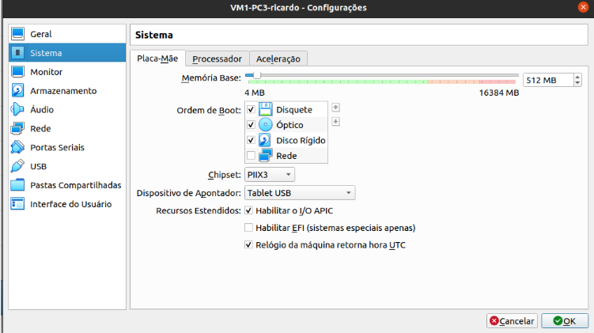

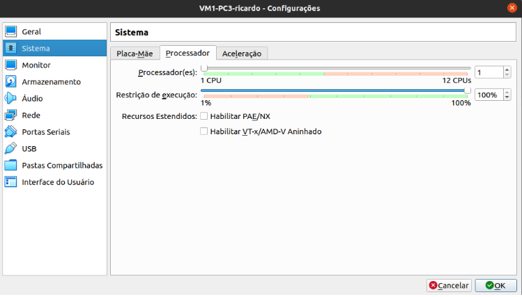

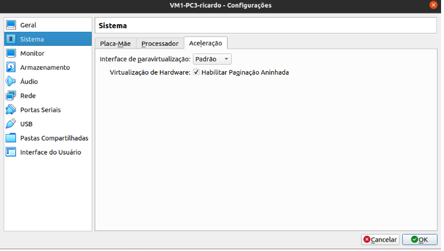

### **3) Criando os Diretórios**

#### 3.1) Entrando no Usuário "redes"

```
su redes
```
<p><center> Figura 1:  Entrando no usuário "redes".</center></p>   


<p><center> Figura 2:  Entrando no usuário "redes" - Inserindo a Senha.</center></p>   
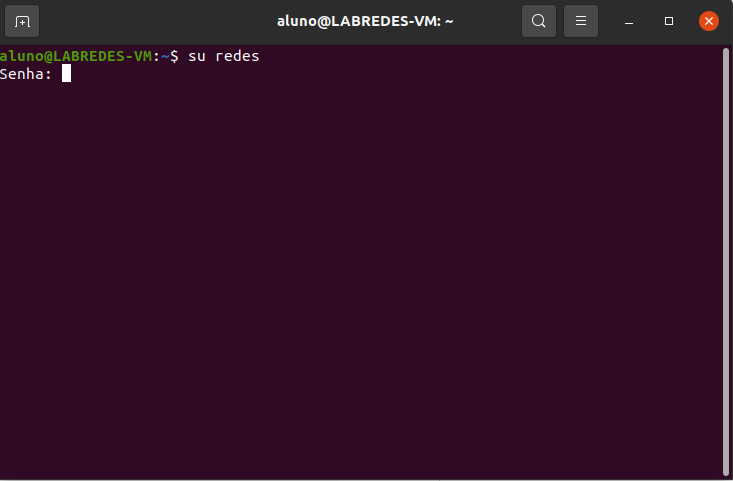

#### 3.2) Verificar se possui os Diretórios

```
/labredes/images/original
/labredes/VM/913/<NomeDoAluno>
```

#### 3.3) Criar os diretórios

* No nosso caso, é necessário criar os diretórios /labredes /VM /913 /fulano.
* Para isso, basta utilizar o comando "sudo mkdir" e o nome do diretório.

```
sudo mkdir labredes
```
<p><center> Figura 3:  Criando o Diretório /labredes.</center></p>   


```
sudo mkdir VM
```
<p><center> Figura 4:  Criando o Diretório /VM.</center></p>   


```
sudo mkdir 913
```
<p><center> Figura 5:  Criando o Diretório /913.</center></p>   
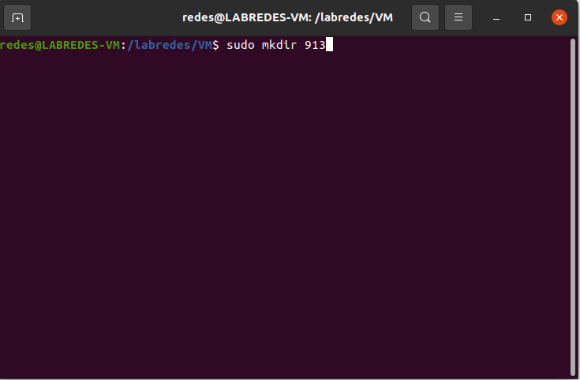

```
sudo mkdir fulano
```
<p><center> Figura 6:  Criando o Diretório /fulano.</center></p>   


#### 3.4) Adicionar o usuário "aluno" no grupo "redes"

```
sudo usermod -aG redes aluno
```
<p><center> Figura 7:  Adicionando "aluno" em "redes".</center></p>   


<p><center> Figura 8:  Adicionando "aluno" em "redes" - Inserindo Senha.</center></p> 
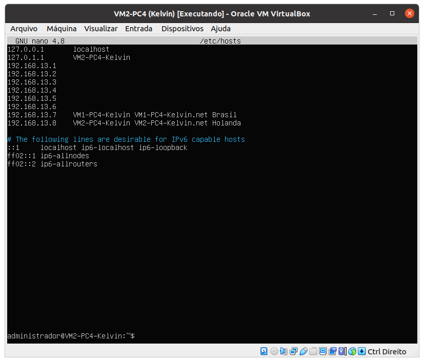

* Modificar o dono da pasta labredes para o usuario nobody e grupo nogroup

```
sudo chown -R nobody:nogroup /labredes
```
<p><center> Figura 9: Modificando o dono da Pasta</center></p> 


* Alterando o proprietário de grupo do diretório /labredes para o grupo redes

```
sudo chgrp -R redes /labredes
```
<p><center> Figura 10: Alterando o proprietário</center></p> 
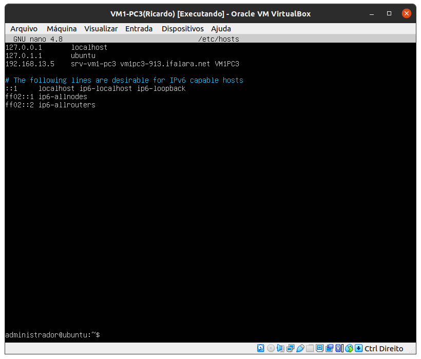

* Alterando as permissões do diretório para escrita pelos membros do grupo
```
sudo chmod -R 771 /labredes 
```
<p><center> Figura 11: Alterando as permissões dos diretórios</center></p> 
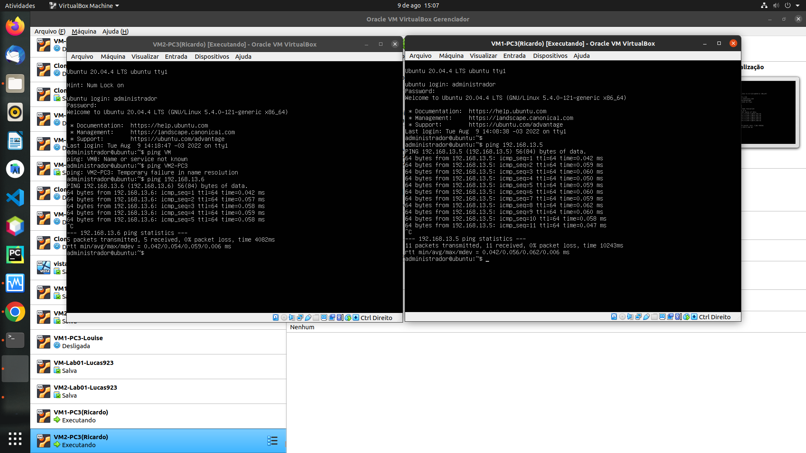

* Listando os Grupos
```
getent group
```
<p><center> Figura 12: Listando os Grupos</center></p> 
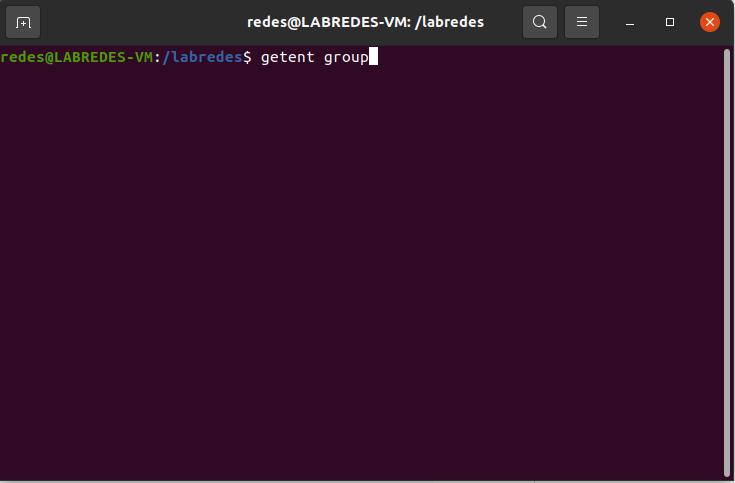

<p><center> Figura 12.1: Listando os Grupos</center></p> 
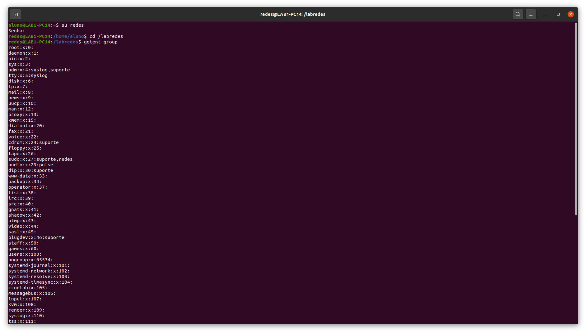


### **4) Criando as VM's**

#### 4.1) Importando o Arquivo

* No VirtualBox, ir na aba ```Arquivos```, na segunda opção ```Importar Appliance```.

<p><center> Figura 13: Importando Appliance</center></p> 
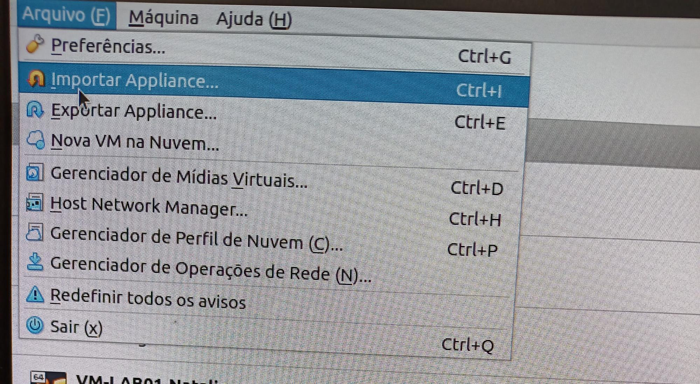

* Na aba ```Importar Appliance```, deve-se inserir o diretório ```/labredes/images/original/ubuntu-server-mini.ova```.
* Nas configurações de Pasta Padrão, deve-se inserir o diretório ```/labredes/VM/913/fulano```.

<p><center> Figura 14: Importando Appliance - Configurações</center></p> 
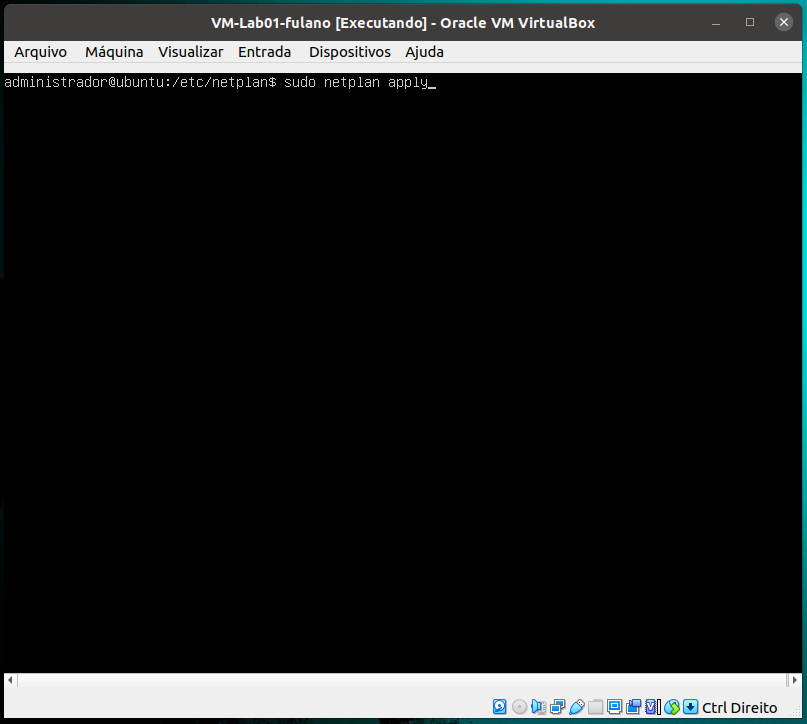

* Após as edições, clicar em ```Importar```.

#### 4.2) Definindo as configurações de Rede

* Selecionar a VM recem-criada e ir em ```Configurações``` -> ```Rede```.
* Habilitar Placa de Rede.
* Criar a Rede Interna.
* Ir em ```Avançado``` e alterar o Endereço MAC.

<p><center> Figura 15: Configurações de Rede das VM's</center></p> 
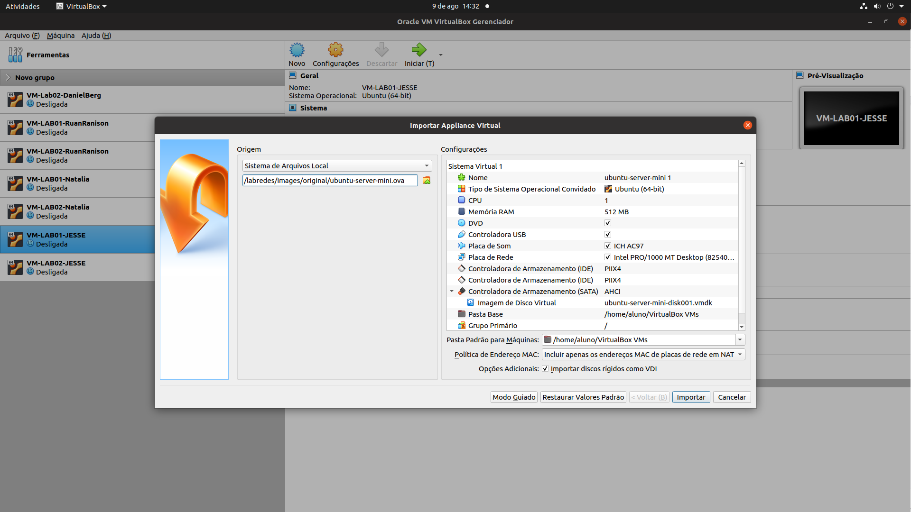

<p><center> Figura 16: Configurações de Rede das VM's - MAC</center></p> 
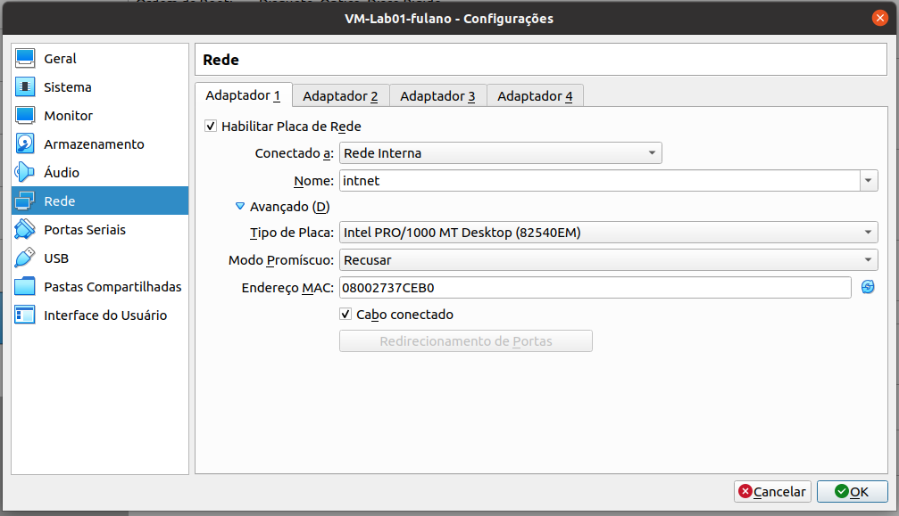

#### 4.3) Repetir os Passos Anteriores

* Repetir os passos anteriores para criar a segunda VM.
* Caso Tenha feito tudo corretamente, ambas as VM's deverão funcionar.

<p><center> Figura 17: VM's funcionando</center></p> 
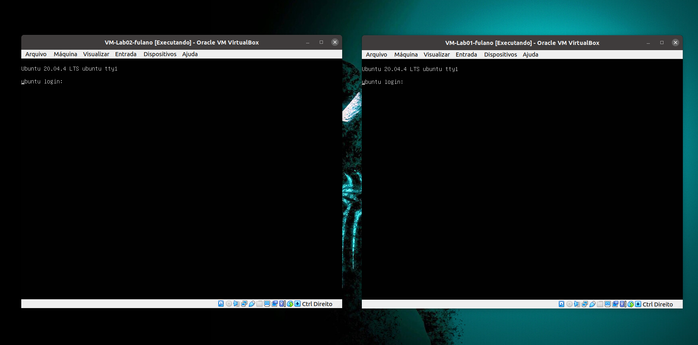

### **5) Configurando o NETPLAN**

* Instalando as ferramentas de rede.

```sudo apt install net-tools -y```

* Após instalar, configurar utilizando o comando sudo nano + diretório do arquivo.

```sudo nano /etc/netplan/01-netcfg.yaml```

* Após, inserir os IP's de acordo com a tabela.

```
   network:
     version: 2
     renderer: networkd
     ethernets:
       enp0s3:                           # nome da interface que está sendo configurada. Verifique com o comando 'ifconfig -a'
         addresses: [192.168.13.<numeroVM-PC>/28]    # IP e Máscara do Host.
         gateway4: 192.168.13.1          # IP do Gateway
         dhcp4: false                  # dhcp4 false -> cliente DHCP está desabilitado, logo o utilizará o IP do campo 'addresses'
 ```
         
* Após, aplicar as configurações utilizando o comando ```sudo netplan apply```.

<p><center> Figura 18: Netplan</center></p> 


### **6) Instalação e Configuração do SSH**

* Primeiramente, deve-se fazer algumas alterações:

1) Alterar a placa de rede para ```NAT```
2) Comentar as linhas de Endereço IP e Gateway e ativar o DHCP. 

```
   network:
     version: 2
     renderer: networkd
     ethernets:
       enp0s3:                           # nome da interface que está sendo configurada. Verifique com o comando 'ifconfig -a'
         #addresses: [192.168.13.<numeroVM-PC>/28]    # IP e Máscara do Host.
         #gateway4: 192.168.13.1          # IP do Gateway
         dhcp4: true                  # dhcp4 false -> cliente DHCP está desabilitado, logo o utilizará o IP do campo 'addresses'
 ```

* Inserir os comandos para as atualizar as definições e pacote do ubuntu

```
sudo apt update       
sudo apt upgrade -y 
```

* Após, instalar o SSH, para isso utilize o comando ```sudo apt-get install openssh-server```
* Após o processo, dar o comando ```systemctl status ssh``` para verificar o status do ssh

<p><center> Figura 19: Instalando o SSH</center></p> 


<p><center> Figura 20: Verificando o Status do SSH</center></p> 
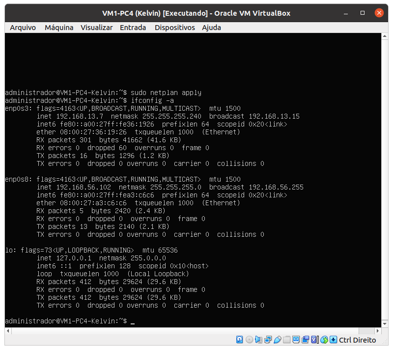

* Verificar o Status das Portas do Sistema, para isso utilize o comando ```netstat -an | grep LISTEN.```

<p><center> Figura 21: Verificando o Status das Portas do Sistema</center></p> 


* Agora deve permitir o SSH no firewall, para isso deve-se utilizar o comando ```sudo ufw allow ssh.```

<p><center> Figura 22: Ativando o SSH no Firewall</center></p> 
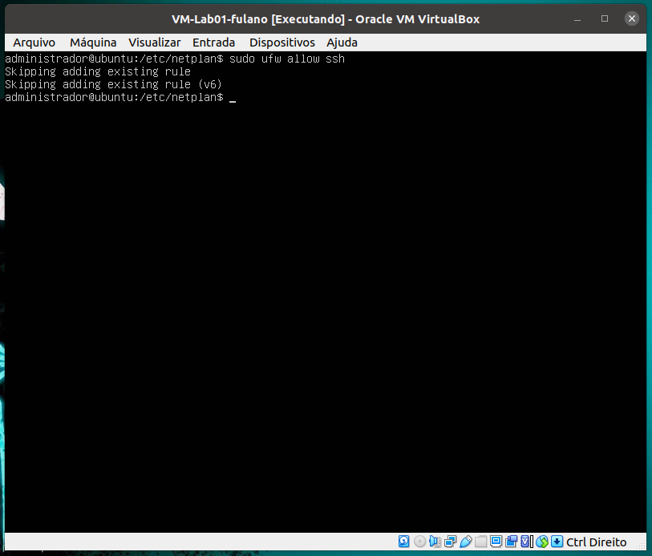

* Verificar o status UFW , para isso deve-se utilizar o comando ```sudo ufw status```
* Ativar o Firewall, utilizando o comando ```sudo ufw enable```

<p><center> Figura 23: Ativando o Firewall</center></p> 
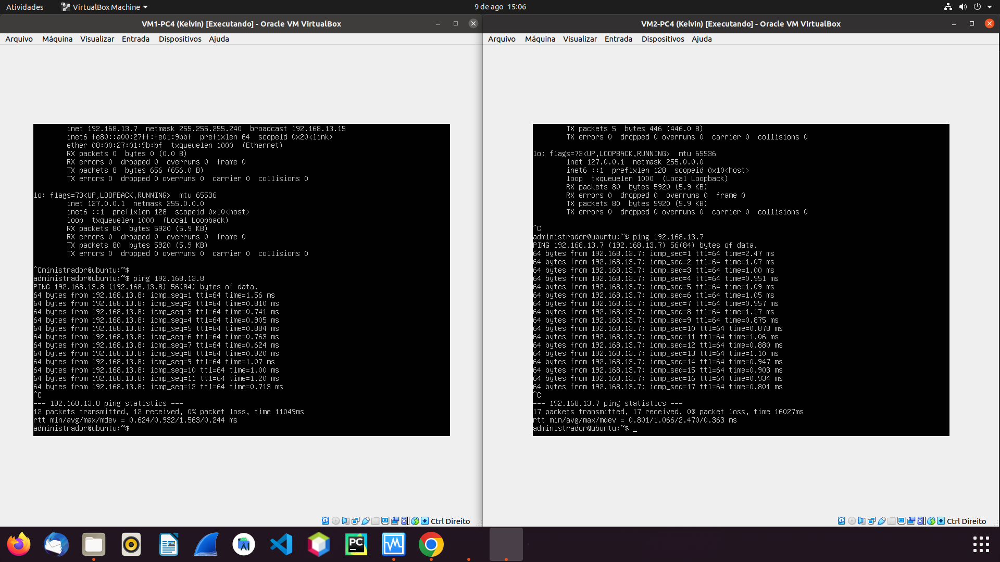

* Após todo o processo, ao conectar, esta tela deve ser exibida.

<p><center> Figura 24: SSH conectado </center></p> 


* Lembrando que após todo o processo, para usufluir, deve-se trocar a rede para o modo bridge.

<p><center> Figura 25: Alterar a Rede para modo Bridge </center></p> 
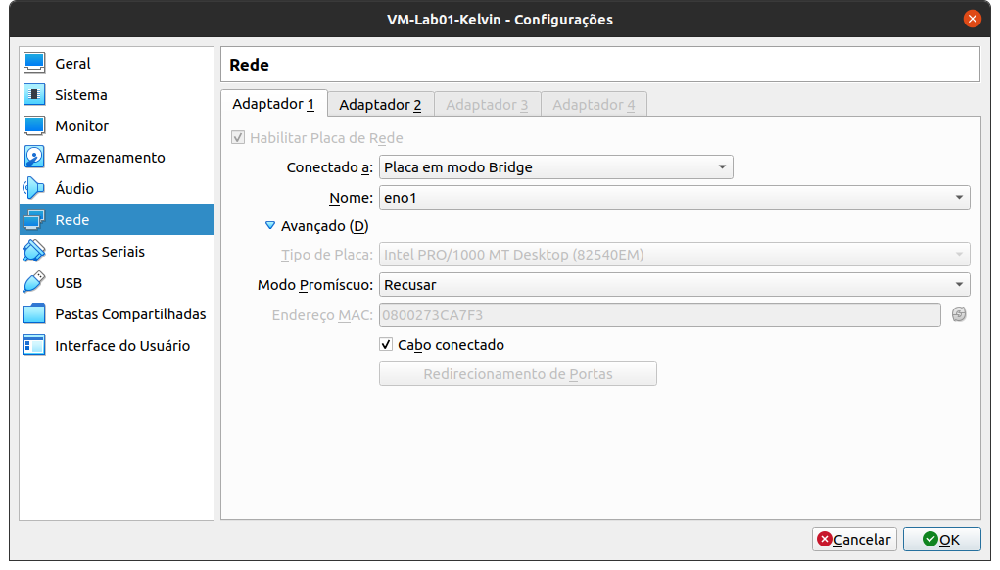


### **7) Criação dos usuários nas VM's**

* Em cada VM serão adicionados 4 usuários, sendo estes cada aluno do grupo.
* Para isso, utiliza-se do comando ```sudo add``` +  ```<nome do aluno>```

 ```
    sudo adduser daniel
    sudo adduser kelvin
    sudo adduser julio
    sudo adduser ricardo
 ```
 
 <p><center> Figura 25: Adicionando usuários </center></p> 
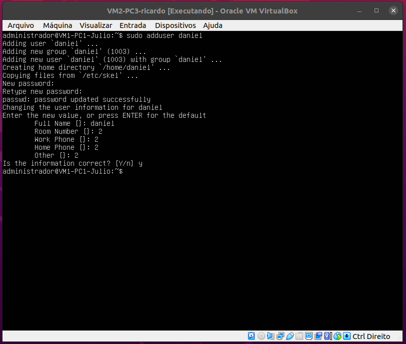

* Pode-se usar o comando ```cat /etc/passwd``` para listar todos os usuários

<p><center> Figura 26: Listando Usuários </center></p> 
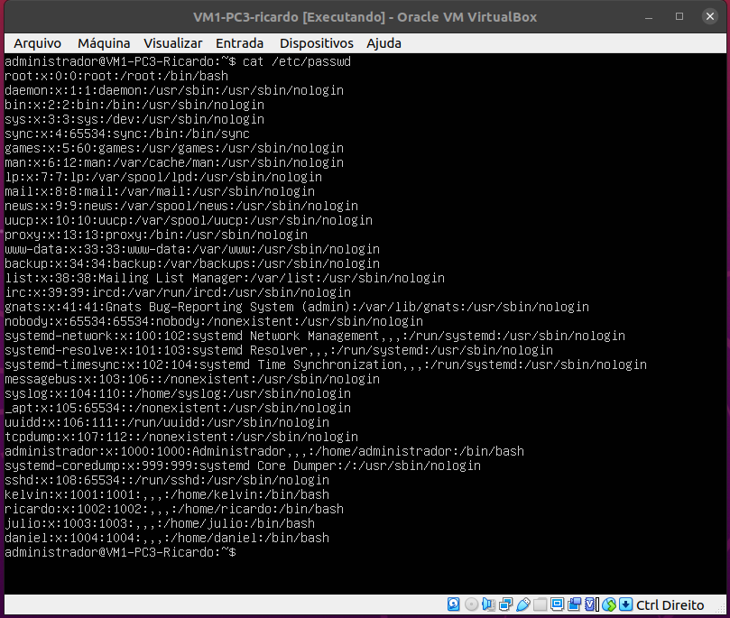


### **8) Adicionando os Hosts**

* Para adicionar os hosts, utilizamos o comando ```sudo nano /etc/hosts```
* Adicionamos de acordo com a tabela definida no inicio
* Após adicionar, pode-se conferir usando o comando ```cat /etc/hosts```

<p><center> Figura 27: Listando Hosts </center></p> 
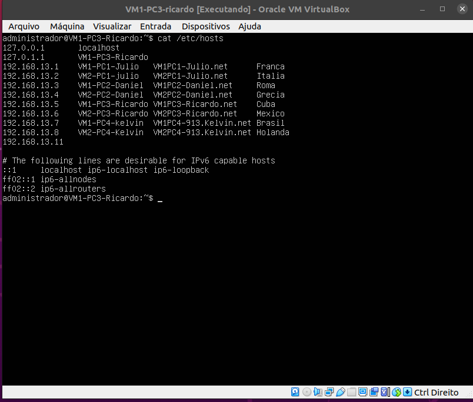


### **9) Testes de Ping e Acesso**

* Todos os testes de ping para testar a conexão.

#### 1) Teste de Ping por IP

<p><center> Figura 28: Teste de Ping por IP </center></p> 


#### 2) Teste de Ping por Apelido 

<p><center> Figura 29: Teste de Ping por Apelido - VM1-PC1 (Franca)</center></p> 
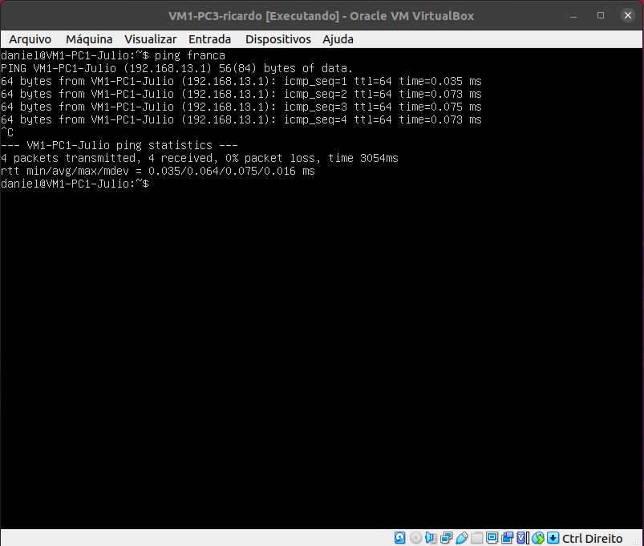

<p><center> Figura 30: Teste de Ping por Apelido - VM2-PC1 (Italia)</center></p> 
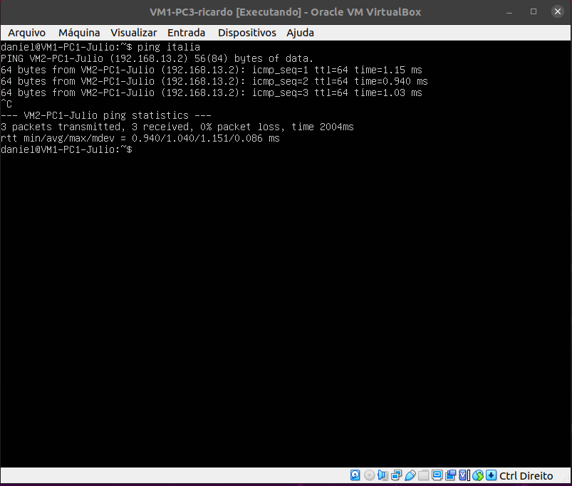

<p><center> Figura 31: Teste de Ping por Apelido - VM1-PC2 (Roma)</center></p> 
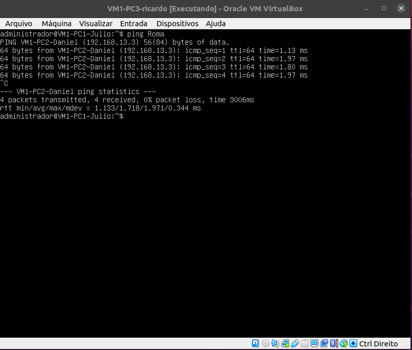

<p><center> Figura 32: Teste de Ping por Apelido - VM2-PC2 (Grecia)</center></p> 
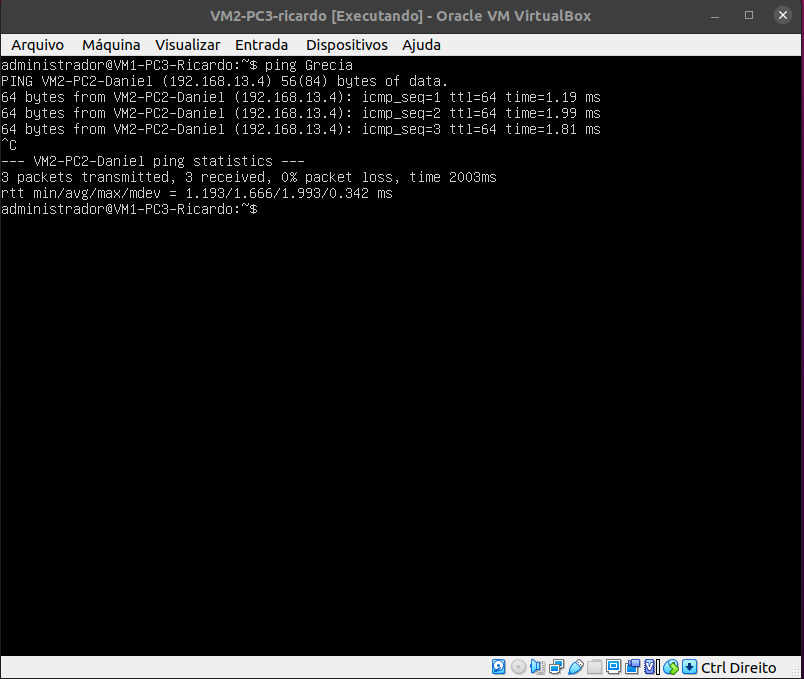

<p><center> Figura 33: Teste de Ping por Apelido - VM1-PC3 (Cuba)</center></p> 
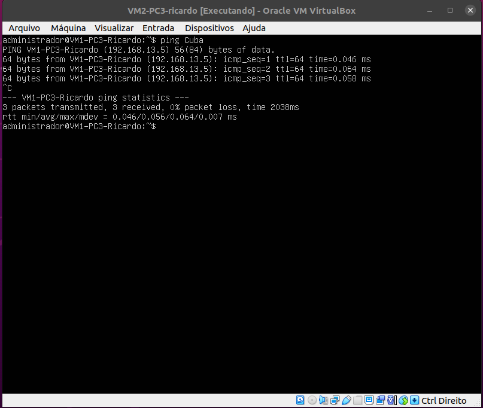

<p><center> Figura 34: Teste de Ping por Apelido - VM2-PC3 (Mexico)</center></p> 


<p><center> Figura 35: Teste de Ping por Apelido - VM1-PC4 (Brasil)</center></p> 
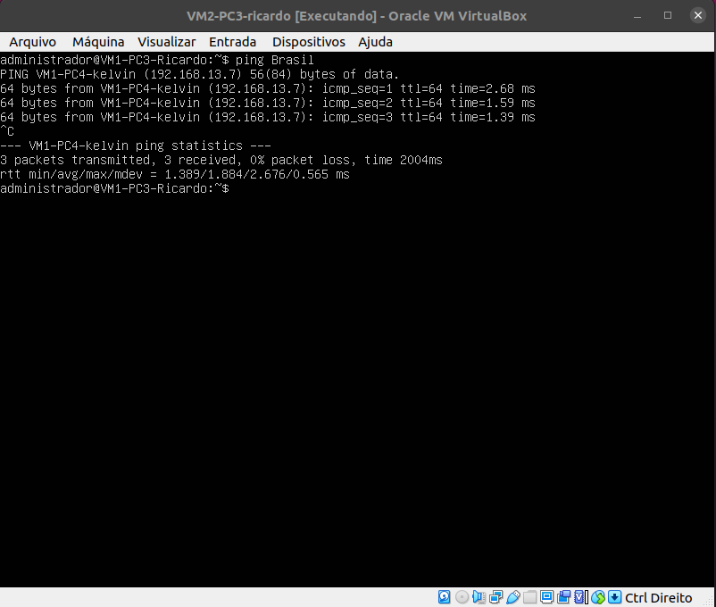

<p><center> Figura 36: Teste de Ping por Apelido - VM2-PC4 (Holanda)</center></p> 
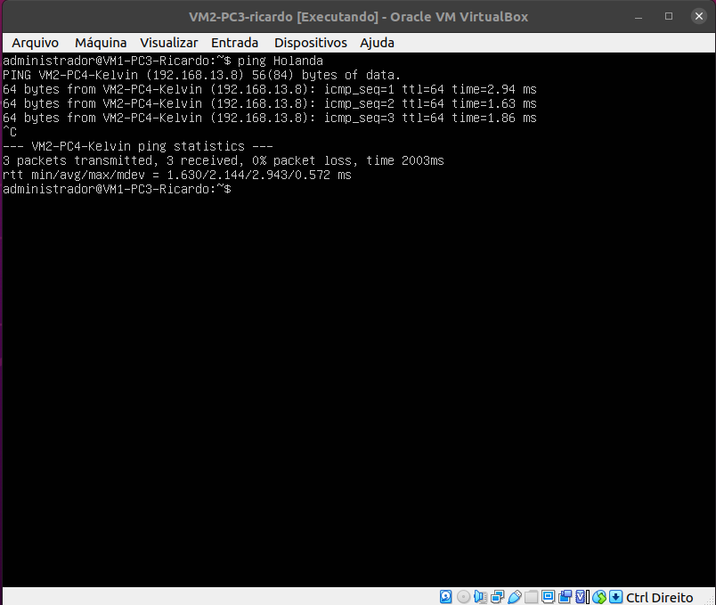


#### 3) Teste de Ping por FQDN 

<p><center> Figura 37: Teste de Ping por FQDN - VM1-PC2</center></p> 


#### 4) Teste de Acesso SSH ao Usuário por Hostname

<p><center> Figura 38: Teste de Acesso por Usuário por Hostname - VM1-PC1 (Julio)</center></p> 
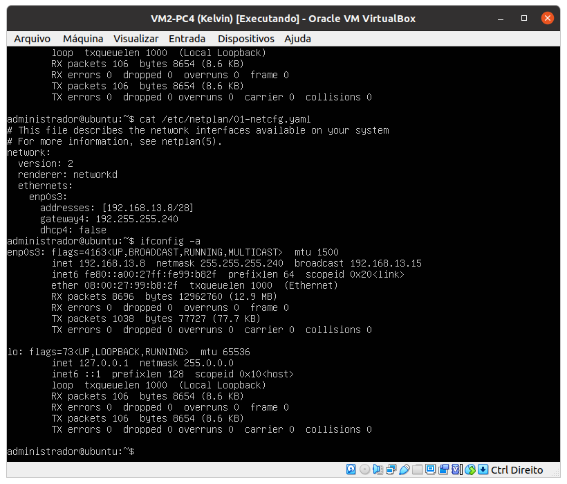

<p><center> Figura 39: Teste de Acesso por Usuário por Hostname - VM2-PC2 (Daniel)</center></p> 
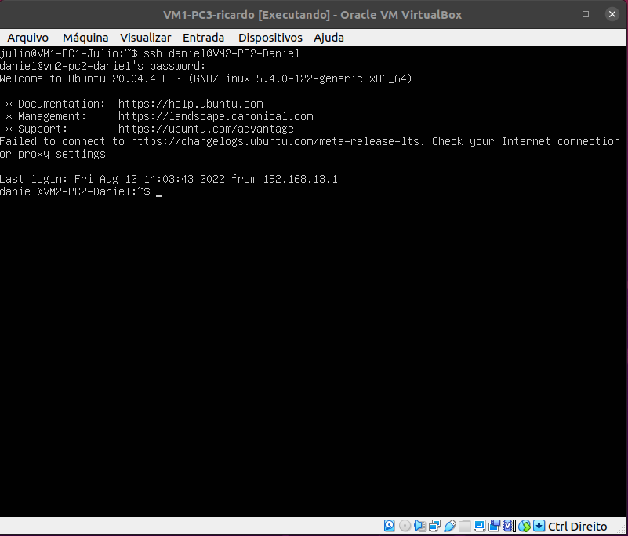

<p><center> Figura 40: Teste de Acesso por Usuário por Hostname - VM1-PC3 (Ricardo)</center></p> 
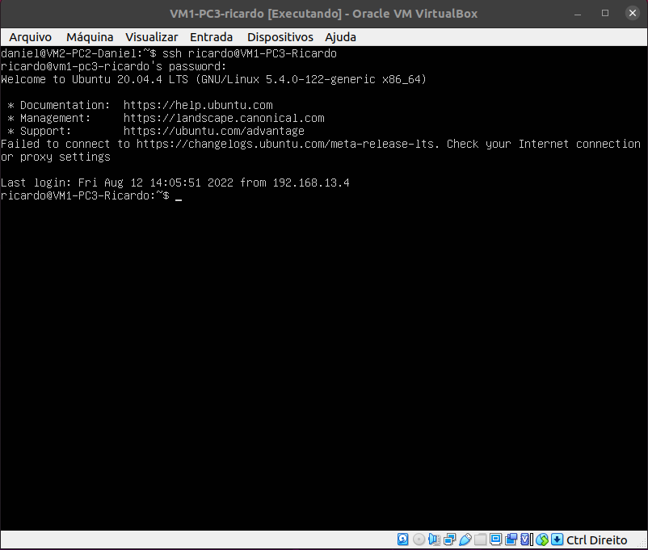

<p><center> Figura 41: Teste de Acesso por Usuário por Hostname - VM1-PC4 (Kelvin)</center></p> 
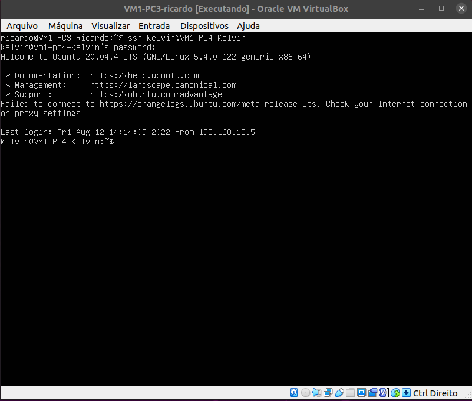

#### 5) Amostra da Topologia-Estrela

<p><center> Figura 42: Topologia na Sala</center></p> 

